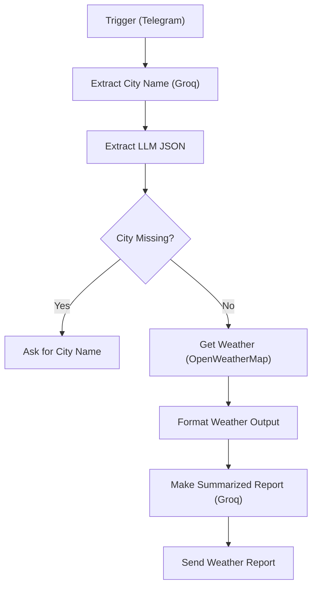

# Weather Reporter

A Telegram bot that takes a natural-language weather question, finds the city in it, fetches live conditions, and replies with a short, polite summary instead of a raw data dump.

## What it does

1. You ask something like "How is the weather in Bangalore?"
2. An LLM extracts only the city name as strict JSON. If no city is mentioned, it returns `not_mentioned`.
3. If no city was found, the bot asks you to resend with a city name.
4. Otherwise it calls OpenWeatherMap for that city's current conditions.
5. A Code node flattens the weather JSON into a plain key-value text block.
6. A second LLM call turns that block into a polite report of under 100 words, using the weather data as its only source.
7. The report is sent back as a Telegram message.

## Example

**Reply from a live run**

> Good day! The sky is currently overcast with light rain (icon 10n). Temperatures hover around 25.4 °C, feeling slightly warmer at 25.7 °C. Humidity sits at 64 %, and atmospheric pressure is steady at 1010 hPa. Winds are blowing from the west‑northwest at about 6.4 m/s, with gusts up to 11.5 m/s. Visibility remains good at 10 km. Stay dry and enjoy your day!

## Flow

## Design decisions

- **The LLM never supplies weather facts.** It extracts a city (temperature 0, JSON mode) and, later, rephrases data it was handed (temperature 0.2). Every number in the reply comes from OpenWeatherMap.
- **A sentinel value handles the "no city" case.** The extraction prompt must return exactly `not_mentioned`, and an IF node checks for that string. The bot can then ask a follow-up question instead of guessing.
- **Data is flattened to text before the second LLM call.** This keeps the prompt small and stops the model from wandering through a large nested JSON object.

## Tech stack

| Component | Role |
|---|---|
| n8n | Orchestration |
| Telegram Bot API | Trigger and reply |
| Groq (`openai/gpt-oss-20b`) | City extraction and report writing |
| OpenWeatherMap API | Live weather data (metric units) |

## Setup

1. Import [`Weather_Reporter.json`](Weather_Reporter.json) into n8n.
2. Attach credentials:
   - Telegram API → **Trigger**, **Ask for City Name**, **Send Weather Report**
   - Groq API → **Extract City Name**, **Make Summarized Report**
   - OpenWeatherMap API → **Get Weather**
3. Activate the workflow and message the bot with a city.

